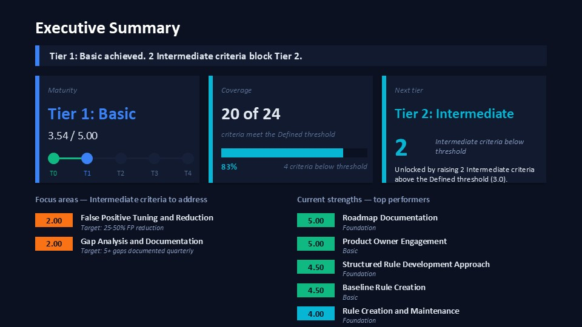
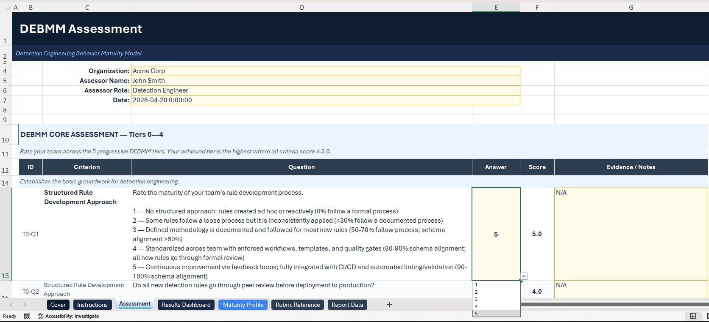
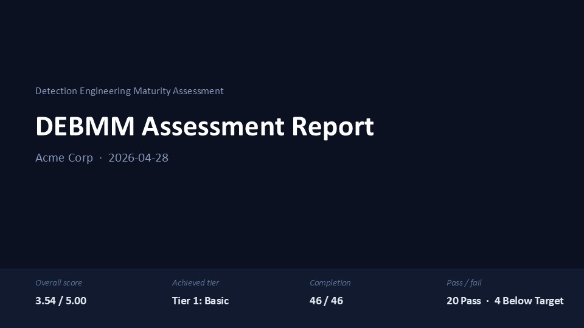
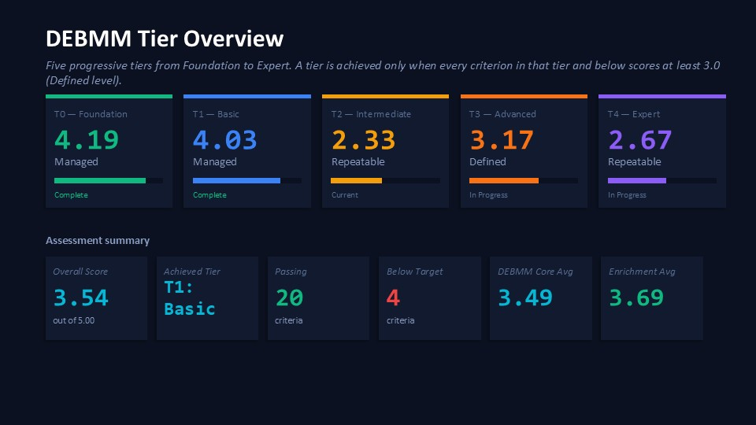
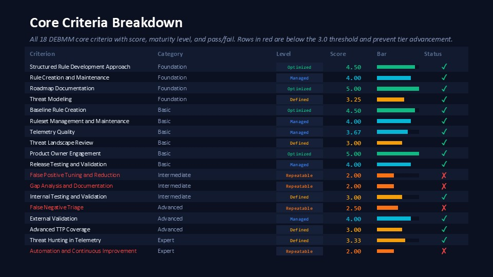
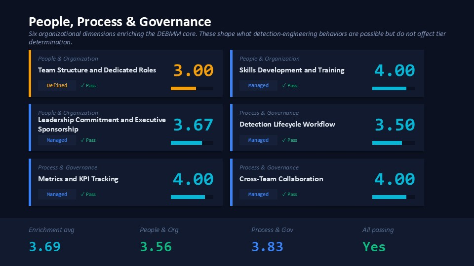

# DEBMM Assessment Tool

A toolkit for SOC managers to assess detection engineering maturity, based on [Elastic's Detection Engineering Behavior Maturity Model (DEBMM)](https://www.elastic.co/security-labs/elastic-releases-debmm) enriched with organizational dimensions from [detectionengineering.io](https://detectionengineering.io/).

## Screenshots

**Executive Summary slide** — the one-slide answer for a CISO: tier achieved, what's working, what blocks the next tier, and the specific criteria to address.



**The workbook** — where the manager actually does the work. 46 dropdown answers across 7 tabs; auto-scoring drives every downstream view.



**Supporting slides in the executive deck.**

<table>
  <tr>
    <td width="50%"></td>
    <td width="50%"></td>
  </tr>
  <tr>
    <td width="50%"></td>
    <td width="50%"></td>
  </tr>
</table>

## Why I Built This

Maturity models tend to live as PDFs — useful as references, hard to actually run on a team. I wanted to use Elastic's DEBMM on a real SOC rather than just read it, so I built this: a dropdown-driven assessment that completes in 30 minutes, automated tier scoring that enforces the model's progressive logic (one prerequisite criterion below Defined caps the achieved tier), monthly history tracking, and an exec-ready PowerPoint output.

The organizational enrichment from [detectionengineering.io](https://detectionengineering.io/) is deliberate — DEBMM focuses on detection behavior, but team structure, training, and governance shape what behaviors are even possible.

## What It Is

A structured assessment covering **24 criteria** across **7 categories** with **46 dropdown questions** (no free-text required):

- **Tier 0 — Foundation**: Rule development, maintenance, roadmaps, threat modeling
- **Tier 1 — Basic**: Baseline rules, ruleset management, telemetry, testing
- **Tier 2 — Intermediate**: False positive reduction, gap analysis, internal validation
- **Tier 3 — Advanced**: False negative triage, external validation, advanced TTP coverage
- **Tier 4 — Expert**: Threat hunting, automation, AI/LLM integration
- **People & Organization** (enrichment): Team structure, training, leadership
- **Process & Governance** (enrichment): Lifecycle, metrics, collaboration

Each criterion is scored on a 1–5 maturity scale (Initial → Optimized). The **achieved tier** is the highest tier where every criterion in that tier and below scores ≥ 3.0 — enforcing the model's progressive philosophy.

The same template handles self-assessments and external audits. Every question has an **Evidence / Notes** column: leave it blank for self-assessments, or fill it in to document the basis for each rating during an audit.

## Prerequisites

- **Python 3.10+** with pip
- **Node.js 18+** with npm (for PowerPoint report generation)
- **Microsoft Excel** or a compatible spreadsheet app

## Quick Start

```bash
# Clone and install
git clone https://github.com/<your-org>/debmm-assessment.git
cd debmm-assessment
pip install -r scorer/requirements.txt
npm install

# Generate the assessment spreadsheet
python scorer/generate_spreadsheet.py
```

Open `templates/debmm-assessment.xlsx` in Excel and fill in your organization details and the 46 dropdown answers across 7 tabs:

| Tab | Purpose |
|-----|---------|
| **Instructions** | Overview and maturity-level definitions |
| **Assessment** | Org details and all 46 questions |
| **Results Dashboard** | Auto-calculated scores, tier determination, color-coded heatmap |
| **Tier Scores Chart** | DEBMM core tier bar chart |
| **Readiness Chart** | Organizational readiness bar chart |
| **Rubric Reference** | Full rubric for reference while answering |
| **Report Data** | Flat data export for Power BI / report generation |

**Save the file in Excel** so all formulas evaluate. Then extract the data and generate the reports:

```bash
# Extract data; --history upserts this period into the trend file
python scorer/extract_data.py templates/debmm-assessment.xlsx -o data.json --history history.json

# Generate the point-in-time and trend PowerPoint reports
node scorer/generate_report.js data.json snapshot.pptx
node scorer/generate_trend.js history.json trend.pptx
```

You only need to regenerate the spreadsheet if you edit the rubric or questionnaire YAML files.

## Monthly Workflow

Repeat the extract + report steps each month. The `--history` flag upserts by period (derived from the spreadsheet's Date field, or override with `--date YYYY-MM`), so re-running mid-month replaces the existing entry rather than appending. Skip `--history` if you only want a point-in-time snapshot.

## Reports

### Point-in-Time (`generate_report.js`)

A 4-slide dark-themed PowerPoint deck for executive review:

| Slide | Content |
|-------|---------|
| **1 — Title** | Overall score, achieved tier, completion count, pass/fail summary |
| **2 — Tier Overview** | 5 tier KPI cards with scores, levels, status indicators, and a progression bar |
| **3 — Core Breakdown** | All 18 DEBMM core criteria with scores, maturity levels, and pass/fail status |
| **4 — Enrichment** | 6 enrichment criteria grouped by category (People & Org, Process & Governance), with averages |

### Trend (`generate_trend.js`)

A 3-slide PowerPoint deck showing progress over time. Works with 1+ history entries (baseline mode in month 1, full trend analysis from month 2 onward):

| Slide | Content |
|-------|---------|
| **1 — Score Trajectory** | Line chart of overall score with 3.0 threshold line and tier achievement badges |
| **2 — Per-Tier Trends** | 5 tier cards with current score, delta from previous month, and sparkline history. Flags assessor changes |
| **3 — Criteria Delta** | "Biggest Improvements" and "Needs Attention" tables with regressions and criteria nearest the 3.0 threshold |

### Edge Cases

| Scenario | Behavior |
|----------|----------|
| Missed a month | Trend chart shows actual dates with gaps — no interpolation |
| Re-run mid-month | `--history` upserts by date; the existing entry is replaced |
| Retroactive entry | Override the period: `... --history history.json --date 2025-12` |
| Assessor changes | Flagged automatically on Slide 2 of the trend report |
| Changed criteria | Only criteria present in both periods are compared; new/removed are handled gracefully |

## Alternative Scoring Paths

```bash
# YAML response file (CI/CD-friendly)
cp templates/response-template.yaml my-assessment.yaml
# fill in answers, then:
python scorer/score.py my-assessment.yaml [--json | --report report.md]

# Score directly from a filled-out spreadsheet
python scorer/score.py --from-xlsx my-assessment.xlsx --report report.md
```

For pen-and-paper or workshop-style assessments, see [`questionnaire/questionnaire.md`](questionnaire/questionnaire.md) — it's printable and includes an Evidence line under every question.

## Project Structure

```
debmm-assessment/
├── README.md
├── LICENSE
├── package.json                          # Node dependencies (pptxgenjs)
├── rubric/
│   ├── rubric.yaml                       # Machine-readable rubric (24 criteria, 5 levels each)
│   └── rubric.md                         # Human-readable rubric with scoring tables
├── questionnaire/
│   ├── questionnaire.yaml                # Master questionnaire (46 questions)
│   └── questionnaire.md                  # Printable questionnaire with Evidence lines
├── scorer/
│   ├── requirements.txt                  # Python dependencies
│   ├── generate_spreadsheet.py           # Builds the all-in-one Excel assessment
│   ├── extract_data.py                   # Excel → JSON for reporting
│   ├── generate_report.js                # 4-slide point-in-time PowerPoint
│   ├── generate_trend.js                 # 3-slide trend PowerPoint
│   ├── score.py                          # CLI scorer (YAML or Excel input)
│   └── report.py                         # Markdown report generator
├── templates/
│   ├── debmm-assessment.xlsx             # Generated spreadsheet (with Evidence column)
│   ├── response-template.yaml            # Blank YAML response template
│   └── example-response.yaml             # Worked example: mid-maturity organization
└── docs/
    └── methodology.md                    # Scoring methodology and interpretation guide
```

## How Scoring Works

- **Scale questions** (1–5): the dropdown selection is the score directly.
- **Checklist questions** (Yes/No): Yes maps to a maturity level (typically 3 or 4); No maps to 1.

**Tier determination**: your achieved tier is the highest tier where every criterion in that tier and below scores ≥ 3.0 (Defined). A single criterion below 3.0 caps the achieved tier. Enrichment categories (People & Organization, Process & Governance) contribute to the overall score but do not affect tier determination.

See [docs/methodology.md](docs/methodology.md) for the full methodology.

## Customization

- **Weights** — edit `weight` values in `rubric.yaml` to emphasize criteria important to your org
- **Questions** — add entries to `questionnaire.yaml` mapped to existing criteria
- **Rubric language** — edit maturity-level descriptions in `rubric.yaml` to match your context
- **Regenerate** — re-run `python scorer/generate_spreadsheet.py` after editing YAML sources

## References

- [Elastic DEBMM](https://www.elastic.co/security-labs/elastic-releases-debmm) — primary framework
- [Detection Engineering Maturity Matrix](https://detectionengineering.io/) — enrichment dimensions
- [MITRE ATT&CK](https://attack.mitre.org/) — threat coverage framework referenced throughout

## License

MIT
